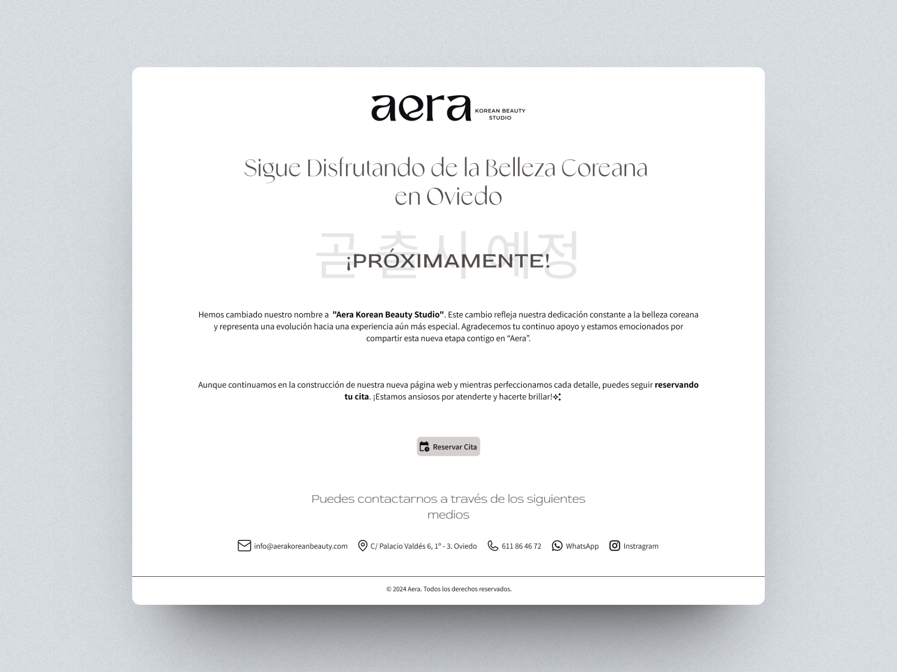
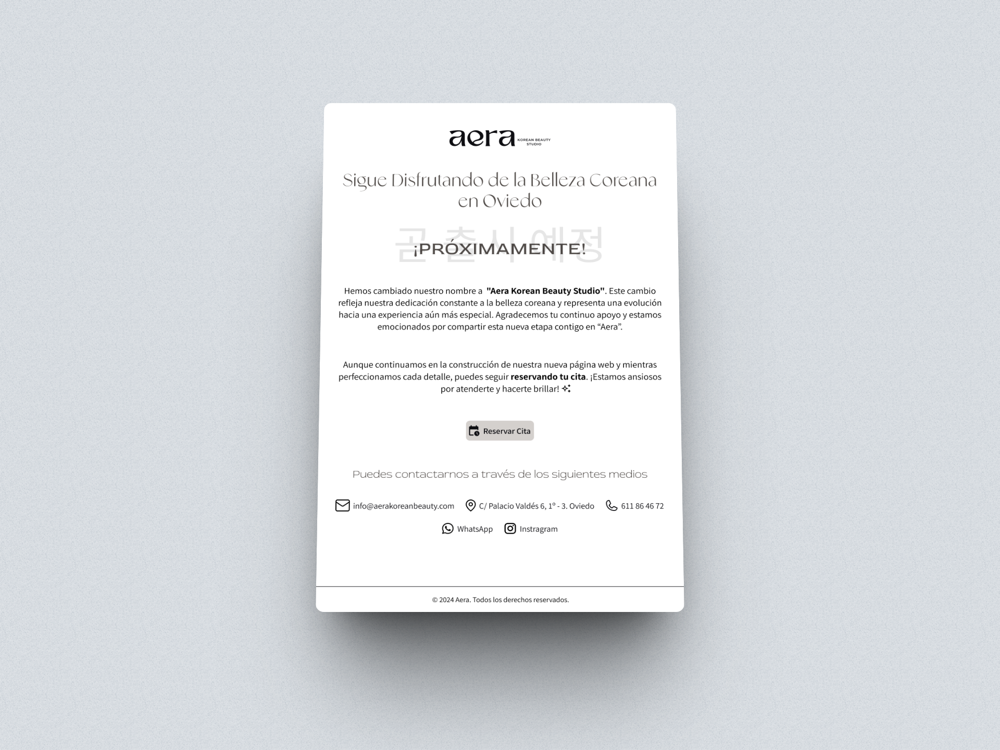
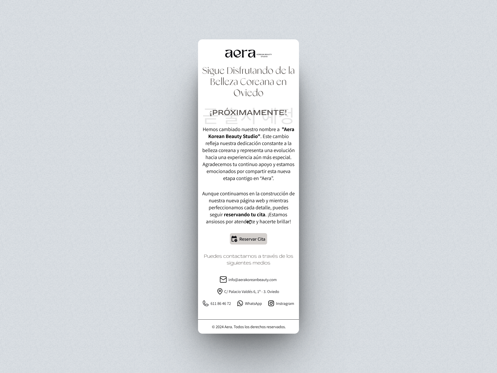

# Página de 'Próximamente'
Este repositorio contiene el código fuente de una página de "Próximamente" para un estudio de tratamientos faciales. 

## Descripción del Proyecto 📋
La página ha sido desarrollada exclusivamente con HTML y CSS, sin el uso de librerías ni frameworks. Este proyecto lo creé con el propósito de practicar GIT y GITHUB además de repasar conocimientos básicos, demostrando la construcción de una página simple utilizando la metodología BEM. El código es ideal para principiantes que deseen explorar y comprender la estructura básica de una página web sin dependencias externas.
Este proyecto a su vez me ayudó como una práctica de los conceptos adquiridos en el curso de Git y GitHub de @freeCodeCamp, impartido por @estefaniacn.

## Capturas de Pantalla o Vistas Previas 💻

## Estado del Proyecto 🚀
La página web ya está desplegada. Aunque esta versión es una vista previa anticipada, los usuarios pueden acceder y explorar la información básica sobre el estudio.
Esta es una página provisional mientras se desarrolla el sitio web completo.
- Enlace a la página: https://aerakoreanbeauty.com/

## Autor 🙋
Este proyecto fue creado por <a href="https://github.com/luischicaizaDev">@luischicaizaDev</a>.
